# Room Subscription Design

Consolidated design document for the unified room model and two-stream message delivery architecture. Covers all message delivery paths with sequence diagrams.

## Architecture Overview

The system uses a **two-stream model** separating notification metadata from message content, combined with per-room presence multicast:

| Stream | Subject pattern | Content | Mechanism | Used for |
|---|---|---|---|---|
| **Ingest** (user → system) | `deliver.{userId}.send.{room}[.thread.{threadId}]` | Full message | Scoped publish, fanout validates + republishes to `chat.>` | All user messages |
| **Notification** (system → user) | `room.notify.{room}` | Metadata only (notifyId, action, user, timestamp) | NATS multicast | Public room notifications |
| **Notification** (system → user) | `deliver.{userId}.notify.{room}` | Metadata only | Per-user delivery | Private/DM room notifications |
| **Content fetch** | `msg.get` | Full message | Request/reply, capability-based (unpredictable notifyId) | On-demand content retrieval |
| **Presence** | `room.presence.{room}` | Diffs (action, userId, status) | NATS multicast | Presence changes |
| **Per-user delivery** | `deliver.{userId}.admin.{room}` | Full message | Fanout service N-copy | Admin messages |
| **Per-user delivery** | `deliver.{userId}.translate.response` | Streaming chunks | Direct publish | Translation streaming |
| **Per-user delivery** | `deliver.{userId}.app.{appId}.{room}.{event}` | App data | Fanout service N-copy | Room app events |

### Security Model

The two-stream model provides defense-in-depth for private/DM rooms:

1. **Ingest validation**: Users publish to `deliver.{userId}.send.>` (NATS auth scopes this per-user). Fanout-service validates sender identity (subject userId must match payload user) and room membership before republishing to `chat.>`.
2. **Notification routing**: Public rooms use multicast (`room.notify.{room}`). Private/DM rooms use per-user delivery (`deliver.{userId}.notify.{room}`), hiding even metadata from non-members.
3. **Capability-based content fetch**: NotifyIds contain crypto-random tokens (`{room}.{seq}.{instanceId}.{randomHex}`). Knowing the notifyId IS the authorization — no user identity in the request.
4. **Fail-closed membership check**: Ingest membership validation returns `false` when room-service is unavailable (denies on uncertainty).

### Browser Subscriptions per User

```
deliver.{userId}.>                     # 1 wildcard (notifications, admin, translate, apps)
room.notify.{room₁}                   # N per-room (public room notifications)
room.notify.{room₂}
...
room.presence.{room₁}                 # N per-room (presence diffs)
room.presence.{room₂}
...
_INBOX.>                               # 1 wildcard (request/reply)
```

Total: `2N + 2` subscriptions where N = number of joined rooms.

Private/DM room notifications arrive via the `deliver.{userId}.>` wildcard — no additional per-room subscription needed.

---

## Sequence Diagrams

### 1. Regular Chat Message (Two-Stream: Notify + Fetch)

A user sends a message in a public room. The fanout service validates, persists via JetStream, caches the content, and publishes a lightweight notification. Browsers fetch content on demand.

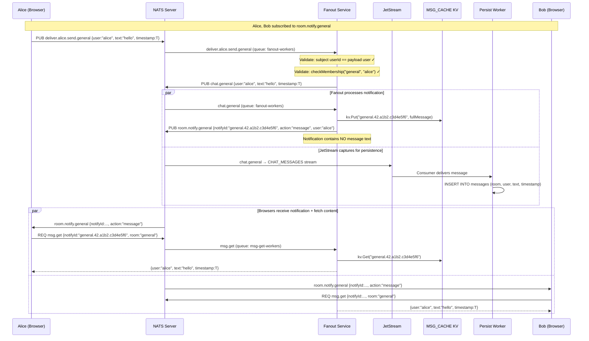

### 2. Private Room Message (Per-User Notification Delivery)

Private room messages use per-user notification delivery. Non-members never see even the notification metadata.

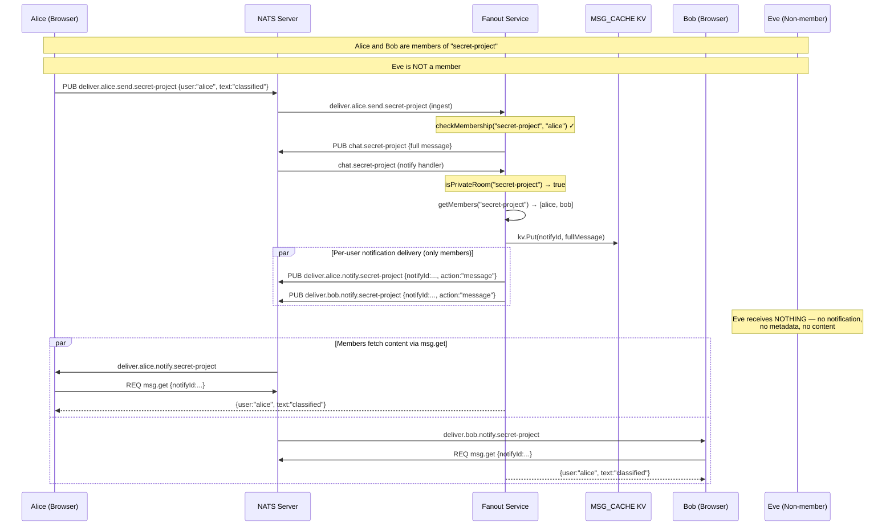

### 3. Thread Reply

Thread replies flow through the same two-stream model. Optional broadcast sends a second copy to the room timeline.

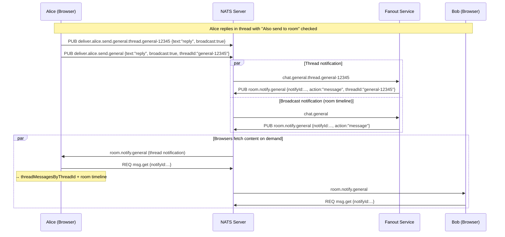

### 4. Room Join (Public Room)

A user joins a public room. Room-service creates a KV entry, publishes a delta, and the browser subscribes to per-room subjects.

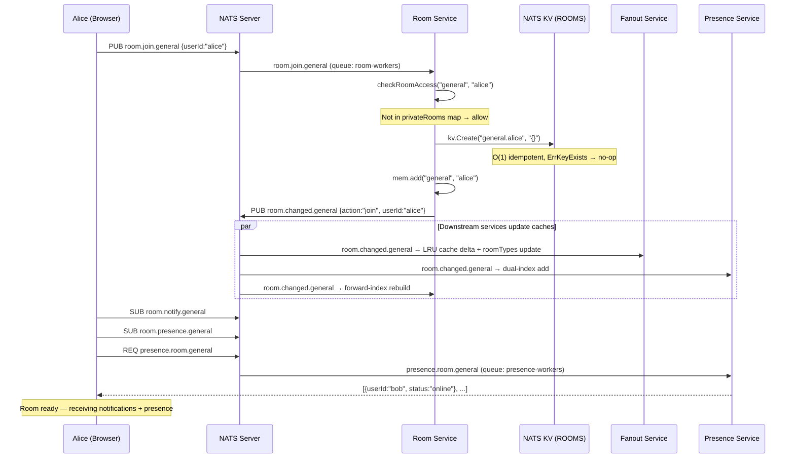

### 5. Room Join (Private Room — Authorization)

Private rooms require DB-backed membership check before allowing join.

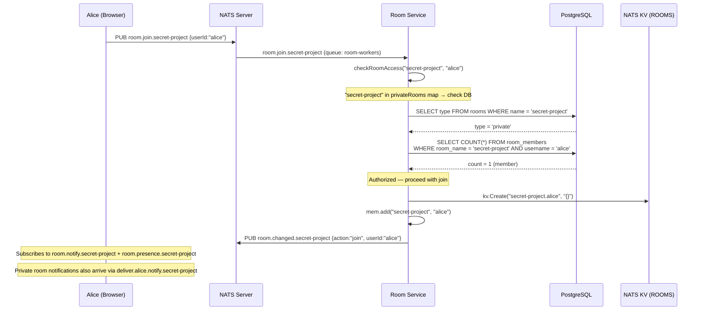

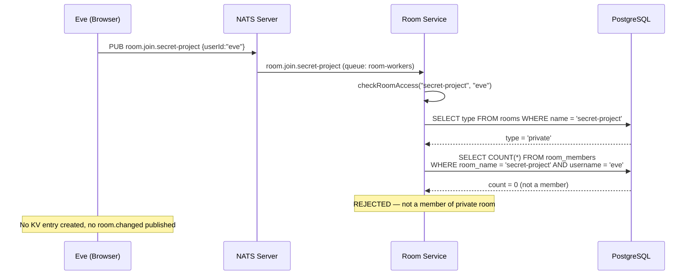

### 6. Private Room Invite

An owner/admin invites a user. The invitee receives a notification via per-user delivery.

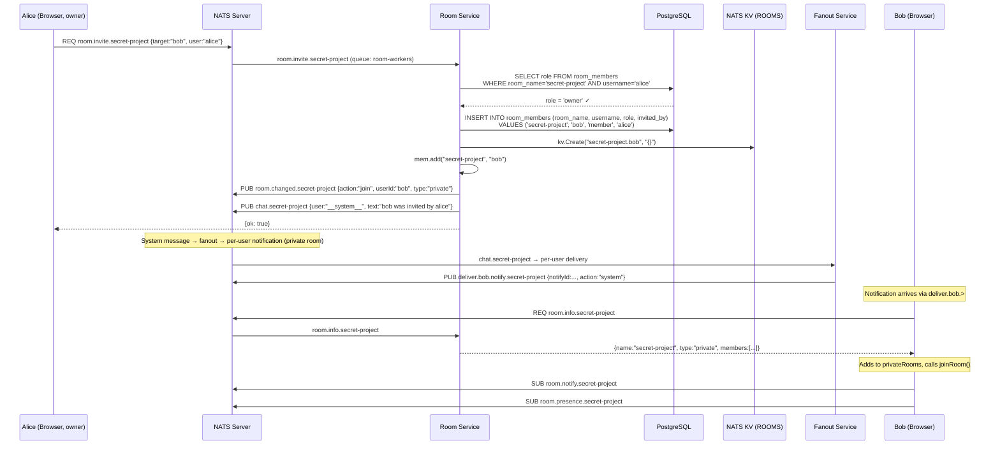

### 7. Room Kick

An owner/admin removes a user. The removal is atomic (DB + KV + cache in one call chain). Per-user delivery ensures the kicked user stops receiving notifications immediately.

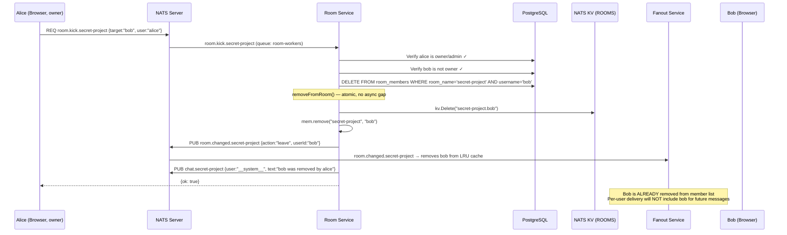

### 8. Presence: Heartbeat → Online Detection → Diff Broadcast

Presence uses two KV buckets and publishes diffs to `room.presence.{room}` (NATS multicast).

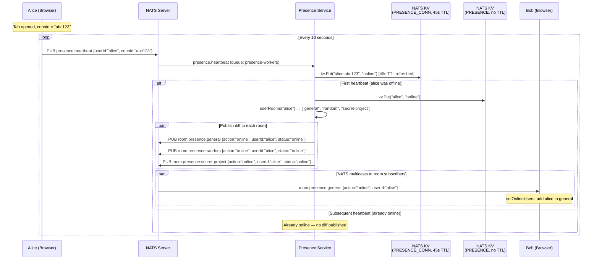

### 9. Presence: Tab Close → Offline Detection

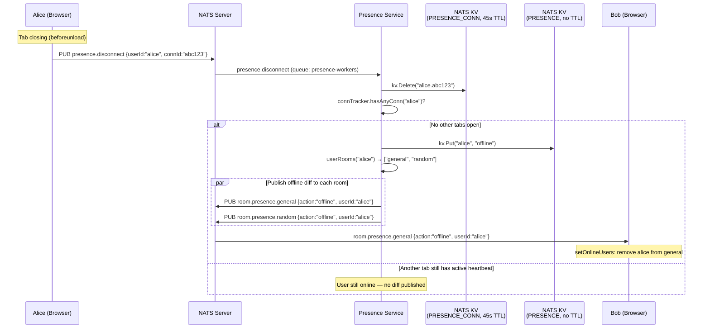

### 10. Presence: Tab Crash (KV TTL Expiry)

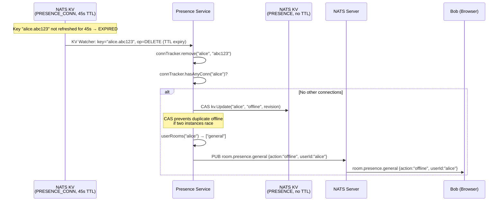

### 11. Status Change (Away/Busy/Online)

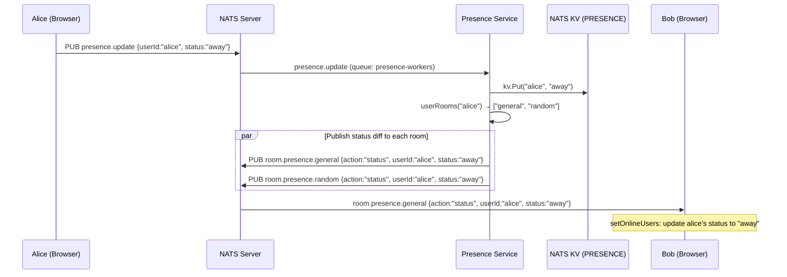

### 12. DM Message Flow

DMs use canonical room names (`dm-alice-bob`) and per-user notification delivery (same as private rooms).

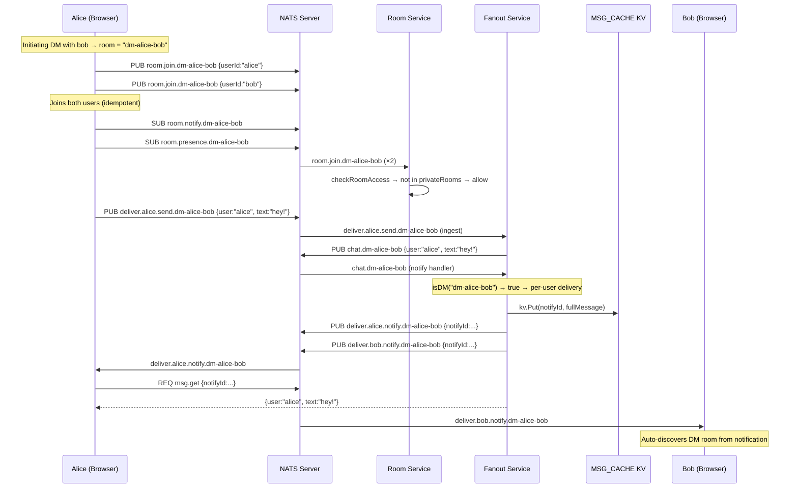

### 13. Reconnection Flow

When the NATS WebSocket reconnects, the browser re-joins all rooms and re-subscribes.


### 14. Room Creation (Private Room)

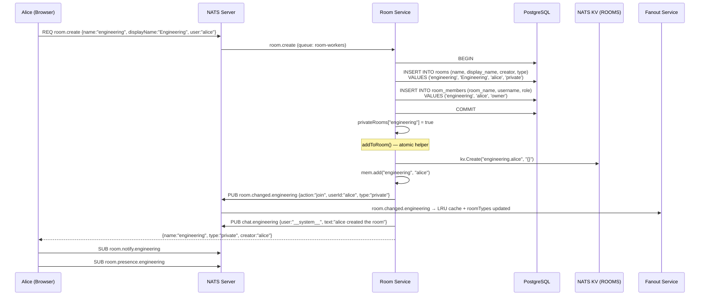

### 15. Room Departure (Voluntary Leave with Ownership Transfer)

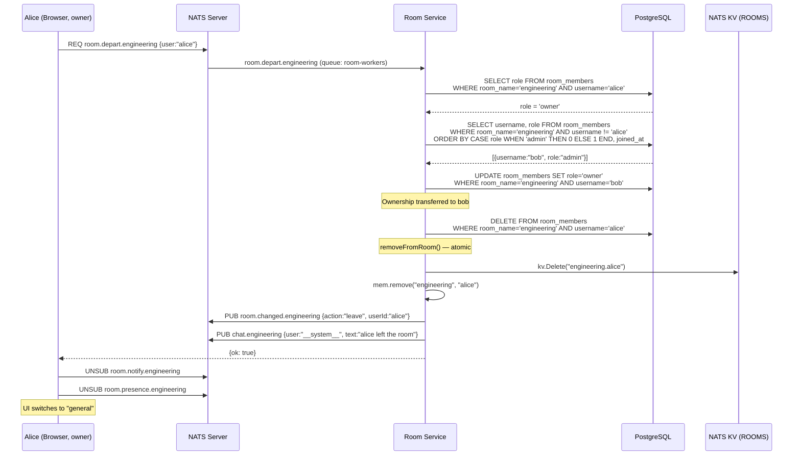

---

## Data Model

### Unified Room Entity

```sql
CREATE TABLE rooms (
    name         TEXT PRIMARY KEY,
    display_name TEXT,
    creator      TEXT NOT NULL,
    type         TEXT NOT NULL DEFAULT 'private',  -- public | private | dm
    created_at   TIMESTAMPTZ DEFAULT NOW()
);

CREATE TABLE room_members (
    room_name    TEXT NOT NULL REFERENCES rooms(name) ON DELETE CASCADE,
    username     TEXT NOT NULL,
    role         TEXT NOT NULL DEFAULT 'member',  -- owner | admin | member
    invited_by   TEXT,
    joined_at    TIMESTAMPTZ DEFAULT NOW(),
    PRIMARY KEY (room_name, username)
);
```

### NATS KV

```
Bucket: ROOMS (FileStorage, History: 1)
Key:    {room}.{userId} → {}

general.alice → {}
secret-project.bob → {}
dm-alice-bob.alice → {}

Bucket: MSG_CACHE (MemoryStorage, TTL: 5m, History: 1)
Key:    {room}.{seq}.{instanceId}.{randomHex} → full message JSON
Purpose: Temporary cache for two-stream content fetch via msg.get
```

### In-Memory State (Room Service)

| Structure | Type | Source | Purpose |
|---|---|---|---|
| `localMembership` | `map[string]map[string]bool` | KV hydration + `room.changed.*` deltas | O(1) `room.members.*` responses |
| `privateRooms` | `map[string]bool` | `SELECT name FROM rooms WHERE type='private'` at startup | O(1) authorization check in `room.join.*` |

### In-Memory State (Fanout Service)

| Structure | Type | Source | Purpose |
|---|---|---|---|
| LRU cache | `lruCache` (room → member set) | `room.members.*` RPC + `room.changed.*` deltas | O(1) membership check, member list for per-user delivery |
| `roomTypes` | `map[string]string` | `room.changed.*` delta events (Type field) | Determine notification routing (multicast vs per-user) |
| `notifySeq` | `atomic.Int64` | Per-instance monotonic counter | Part of notifyId generation |
| `instanceId` | `string` | `randomHex(4)` at startup | Part of notifyId — avoids collision across instances |

---

## NATS Subject Reference

### Ingest (user → system, QG: fanout-workers)

| Subject | Payload | Handler |
|---|---|---|
| `deliver.{userId}.send.{room}` | Full chat message | Validate sender + membership, republish to `chat.{room}` |
| `deliver.{userId}.send.{room}.thread.{threadId}` | Full thread reply | Same as above, republish to `chat.{room}.thread.{threadId}` |

### Notification (system → user)

| Subject | Payload | Routing |
|---|---|---|
| `room.notify.{room}` | `{notifyId, room, action, user, timestamp, threadId?, emoji?, targetUser?}` | NATS multicast (public rooms only) |
| `deliver.{userId}.notify.{room}` | Same notification format | Per-user delivery (private/DM rooms) |

### Content Fetch (request/reply, QG: msg-get-workers)

| Subject | Request | Response |
|---|---|---|
| `msg.get` | `{notifyId, room}` | Full message JSON or `{error}` |

### Chat Messages (internal — JetStream captured)

| Subject | Published by | Consumed by |
|---|---|---|
| `chat.{room}` | Fanout ingest handler | Fanout notify handler + JetStream → persist-worker |
| `chat.{room}.thread.{threadId}` | Fanout ingest handler | Fanout notify handler + JetStream → persist-worker |
| `admin.{room}` | Backend services | Fanout → `deliver.{userId}.admin.{room}` |

### Room Management (request/reply, QG: room-workers)

| Subject | Payload | Response |
|---|---|---|
| `room.create` | `{name, displayName, user}` | `RoomInfo` or `{error}` |
| `room.list` | `{user}` | `RoomInfo[]` |
| `room.info.*` | _(empty)_ | `RoomInfo` with `members[]` |
| `room.invite.*` | `{target, user}` | `{ok: true}` or `{error}` |
| `room.kick.*` | `{target, user}` | `{ok: true}` or `{error}` |
| `room.depart.*` | `{user}` | `{ok: true}` or `{error}` |

### Room Membership (pub/sub)

| Subject | QG | Payload | Publisher |
|---|---|---|---|
| `room.join.*` | `room-workers` | `{userId}` | Browser |
| `room.leave.*` | `room-workers` | `{userId}` | Browser (tab close) |
| `room.changed.*` | _(none)_ | `{action, userId, type?}` | Room Service |
| `room.members.*` | `room-members-workers` | _(request/reply)_ | Fanout (cache miss) |

### Presence

| Subject | QG | Payload |
|---|---|---|
| `presence.heartbeat` | `presence-workers` | `{userId, connId}` |
| `presence.disconnect` | `presence-workers` | `{userId, connId}` |
| `presence.update` | `presence-workers` | `{userId, status}` |
| `presence.room.*` | `presence-workers` | _(request/reply → `PresenceMember[]`)_ |
| `room.presence.*` | _(none, multicast)_ | `{action, userId, status?}` |

---

## Design Decisions

| Decision | Choice | Rationale |
|---|---|---|
| Message delivery | Two-stream: notification ID + content fetch | Notifications never contain message text; content retrieval is capability-gated |
| Ingest path | `deliver.{userId}.send.>` | NATS auth scopes publish per-user; fanout validates sender identity from subject |
| Public room notifications | Per-room multicast (`room.notify.*`) | Eliminates O(members) publish amplification; NATS kernel-level sendmsg |
| Private/DM room notifications | Per-user delivery (`deliver.{userId}.notify.*`) | Hides even notification metadata from non-members |
| Content authorization | Capability-based (unpredictable notifyId) | No forgeable user identity; knowing the notifyId = proof of notification receipt |
| NotifyId format | `{room}.{seq}.{instanceId}.{randomHex}` | Instance ID avoids cross-replica collision; random token prevents enumeration |
| MSG_CACHE storage | MemoryStorage, 5min TTL | Ephemeral cache — messages are persisted to PostgreSQL via JetStream independently |
| Membership check failure | Fail-closed (deny) | Rejects ingest when room-service is unavailable; security over availability |
| Room type tracking | `roomTypes` map from `room.changed.*` deltas | Fanout-service decides delivery path (multicast vs per-user) without DB access |
| Presence delivery | Per-room multicast (`room.presence.*`) | Diffs are tiny (~50 bytes); multicast avoids N-copy overhead |
| Presence format | Diff events (`{action, userId, status}`) | O(1) payload vs O(members) full snapshot; client applies incrementally |
| Initial presence | Request/reply (`presence.room.*`) | Full snapshot needed once on room join; subsequent updates via diffs |
| Private room auth | DB query in `room.join.*` handler | Local function call, no NATS round-trip; fail-open on DB error |
| Room mutations | `addToRoom()`/`removeFromRoom()` helpers | Atomic KV + cache + delta — no async gap for race conditions |
| DM rooms | Canonical `dm-{sorted-users}` naming | Reuses all room infrastructure with zero special-casing |
| Unified type field | `rooms.type` enum (public/private/dm) | Replaces `is_private` boolean; extensible for future room types |
| Message dedup | Synchronous ref-based `timestamp+user` guard | Prevents duplicate display and unread count increments during token refresh reconnections |

---

## Message Deduplication

### Problem

During Keycloak token refresh (every 30s), the NATS WebSocket connection is replaced. There is a brief window where both the old and new connections have active subscriptions to `room.notify.{room}`. Notifications arriving during this overlap are processed twice, causing duplicate content fetches, display, and double-counting of unread notifications.

### Solution

MessageProvider applies a **synchronous dedup guard** before processing each incoming message. The guard checks `messagesByRoomRef.current` (a React ref mirroring the latest state) for an existing message with the same `timestamp + user` combination.

```
Incoming notification on room.notify.{room}:

1. Fetch content via msg.get (notifyId → full message)
2. isDup = messagesByRoomRef.current[room].some(
     m => m.timestamp === data.timestamp && m.user === data.user
   )
3. if (isDup) return;             ← skip ALL processing (no state updates, no unread increment)
4. setMessagesByRoom(...)         ← add to room timeline
5. Update unread counts           ← only runs if not a duplicate
```

**Critical detail:** The dedup check uses a synchronous ref (`messagesByRoomRef.current`), not an async state setter callback. This ensures the unread count increment (step 5) is also skipped for duplicates.

### Dedup Scope

| Message type | Dedup key | Location |
|---|---|---|
| Room messages (`room.notify.*` / `deliver.*.notify.*`) | `timestamp + user` | Synchronous guard in `processRoomChatMessage` before `setMessagesByRoom` |
| Thread messages (via notification fetch) | `timestamp + user` | Inside `setThreadMessagesByThreadId` setter (no unread tracking for threads) |
| Admin messages (`deliver.*.admin.*`) | `timestamp + user` | Synchronous guard before `setMessagesByRoom` |

---

## Known Limitations

### Presence metadata leakage for private rooms

Presence-service publishes `room.presence.{room}` for all rooms via NATS multicast. Since browsers subscribe to `room.presence.*`, a non-member could subscribe to `room.presence.{privateRoom}` and observe who is online. This is a separate concern from the two-stream model and requires presence-service changes to route private room presence via per-user delivery. Tracked as a follow-up.
