# Room Subscription Design

Consolidated design document for the unified room model and hybrid subscription architecture. Covers all message delivery paths with sequence diagrams.

## Architecture Overview

The system uses a **hybrid subscription model** combining per-room NATS multicast (high-volume chat) with per-user delivery (low-volume targeted messages):

| Delivery path | Subject pattern | Mechanism | Used for |
|---|---|---|---|
| Per-room multicast | `room.msg.{room}` | NATS native multicast | Main room chat messages |
| Per-room multicast | `room.presence.{room}` | NATS native multicast | Presence diffs (online/offline/status) |
| Per-user delivery | `deliver.{userId}.chat.{room}.thread.{threadId}` | Fanout service N-copy | Thread replies |
| Per-user delivery | `deliver.{userId}.admin.{room}` | Fanout service N-copy | Admin messages |
| Per-user delivery | `deliver.{userId}.translate.response` | Direct publish | Translation streaming |
| Per-user delivery | `deliver.{userId}.app.{appId}.{room}.{event}` | Fanout service N-copy | Room app events |

### Browser Subscriptions per User

```
deliver.{userId}.>                     # 1 wildcard (threads, admin, translate, apps)
room.msg.{room₁}                      # N per-room (chat messages)
room.msg.{room₂}
...
room.presence.{room₁}                 # N per-room (presence diffs)
room.presence.{room₂}
...
_INBOX.>                               # 1 wildcard (request/reply)
```

Total: `2N + 2` subscriptions where N = number of joined rooms.

---

## Sequence Diagrams

### 1. Regular Chat Message (Per-Room Multicast)

A user sends a message in a public room. The fanout service re-publishes to `room.msg.{room}` and NATS multicasts to all subscribers.


### 2. Thread Reply (Per-User Delivery)

Thread replies use per-user `deliver.{userId}.*` delivery. Optional broadcast sends a second copy through `room.msg.*`.

```mermaid
sequenceDiagram
    participant Alice as Alice (Browser)
    participant NATS as NATS Server
    participant Fanout as Fanout Service
    participant Bob as Bob (Browser)
    participant Carol as Carol (Browser)

    Note over Alice,Carol: Alice replies in thread with "Also send to channel" checked
    Note over Alice,Carol: Thread panel shows reply; room timeline shows broadcast copy

    Alice->>NATS: PUB chat.general.thread.general-12345 {text:"reply", broadcast:true}
    Alice->>NATS: PUB chat.general {text:"reply", broadcast:true, threadId:"general-12345"}
    
    par Thread copy → per-user fanout
        NATS->>Fanout: chat.general.thread.general-12345 (queue: fanout-workers)
        Fanout->>Fanout: getMembers("general") → [alice, bob, carol]
        par Worker pool (32 goroutines)
            Fanout->>NATS: PUB deliver.alice.chat.general.thread.general-12345
            Fanout->>NATS: PUB deliver.bob.chat.general.thread.general-12345
            Fanout->>NATS: PUB deliver.carol.chat.general.thread.general-12345
        end
    and Broadcast copy → room.msg multicast
        NATS->>Fanout: chat.general (queue: fanout-workers)
        Fanout->>NATS: PUB room.msg.general {broadcast copy}
    end

    par Thread replies via deliver.*
        NATS->>Alice: deliver.alice.chat.general.thread.general-12345
        Note over Alice: → threadMessagesByThreadId
        NATS->>Bob: deliver.bob.chat.general.thread.general-12345
        Note over Bob: → threadMessagesByThreadId
    end

    par Broadcast copy via room.msg.*
        NATS->>Alice: room.msg.general {broadcast copy}
        Note over Alice: → messagesByRoom (room timeline)
        NATS->>Bob: room.msg.general {broadcast copy}
        NATS->>Carol: room.msg.general {broadcast copy}
    end

    
```

### 3. Room Join (Public Room)

A user joins a public room. Room-service creates a KV entry, publishes a delta, and the browser subscribes to per-room subjects.


### 4. Room Join (Private Room — Authorization)

Private rooms require DB-backed membership check before allowing join.


### 5. Private Room Invite

An owner/admin invites a user. The invitee's browser auto-discovers the room.


### 6. Room Kick

An owner/admin removes a user. The removal is atomic (DB + KV + cache in one call chain).

```mermaid
sequenceDiagram
    participant Alice as Alice (Browser, owner)
    participant NATS as NATS Server
    participant RoomSvc as Room Service
    participant DB as PostgreSQL
    participant KV as NATS KV (ROOMS)
    participant Fanout as Fanout Service
    participant Bob as Bob (Browser)

    Alice->>NATS: REQ room.kick.secret-project {target:"bob", user:"alice"}
    NATS->>RoomSvc: room.kick.secret-project (queue: room-workers)

    RoomSvc->>DB: Verify alice is owner/admin ✓
    RoomSvc->>DB: Verify bob is not owner ✓
    RoomSvc->>DB: DELETE FROM room_members WHERE room_name='secret-project' AND username='bob'

    Note over RoomSvc: removeFromRoom() — atomic, no async gap

    RoomSvc->>KV: kv.Delete("secret-project.bob")
    RoomSvc->>RoomSvc: mem.remove("secret-project", "bob")
    RoomSvc->>NATS: PUB room.changed.secret-project {action:"leave", userId:"bob"}

    NATS->>Fanout: room.changed.secret-project → removes bob from LRU cache

    RoomSvc->>NATS: PUB chat.secret-project {user:"__system__", text:"bob was removed by alice"}
    RoomSvc-->>Alice: {ok: true}

    Note over Fanout: Bob is ALREADY removed from delivery list<br/>No async gap where bob could receive messages

    Note over Bob: Next access to channel → room.info shows not a member<br/>UI renders: 🔒 "You are no longer a member"
```



### 7. Presence: Heartbeat → Online Detection → Diff Broadcast

Presence uses two KV buckets and publishes diffs to `room.presence.{room}` (NATS multicast).


### 8. Presence: Tab Close → Offline Detection


### 9. Presence: Tab Crash (KV TTL Expiry)


### 10. Status Change (Away/Busy/Online)


### 11. DM Message Flow

DMs use canonical room names (`dm-alice-bob`) and flow through the same infrastructure.

```mermaid
sequenceDiagram
    participant Alice as Alice (Browser)
    participant NATS as NATS Server
    participant RoomSvc as Room Service
    participant Fanout as Fanout Service
    participant Bob as Bob (Browser)

    Note over Alice: Initiating DM with bob → room = "dm-alice-bob"

    Alice->>NATS: PUB room.join.dm-alice-bob {userId:"alice"}
    Alice->>NATS: PUB room.join.dm-alice-bob {userId:"bob"}
    Note over Alice: Joins both users (idempotent)

    Alice->>NATS: SUB room.msg.dm-alice-bob
    Alice->>NATS: SUB room.presence.dm-alice-bob

    NATS->>RoomSvc: room.join.dm-alice-bob (×2)
    RoomSvc->>RoomSvc: checkRoomAccess → not in privateRooms → allow
    Note over RoomSvc: KV create for both users

    Alice->>NATS: PUB chat.dm-alice-bob {user:"alice", text:"hey!"}
    NATS->>Fanout: chat.dm-alice-bob (queue: fanout-workers)
    Fanout->>NATS: PUB room.msg.dm-alice-bob {same payload}

    NATS->>Alice: room.msg.dm-alice-bob
    NATS->>Bob: room.msg.dm-alice-bob
    Note over Bob: If not subscribed yet, message arrives<br/>via deliver.bob.> → auto-discovers DM room
```



### 12. Reconnection Flow

When the NATS WebSocket reconnects, the browser re-joins all rooms and re-subscribes.


### 13. Room Creation (Private Room)


### 14. Room Departure (Voluntary Leave with Ownership Transfer)


---

## Data Model

### Unified Room Entity

```sql
CREATE TABLE rooms (
    name         TEXT PRIMARY KEY,
    display_name TEXT,
    creator      TEXT NOT NULL,
    type         TEXT NOT NULL DEFAULT 'private',  -- public | private | dm
    created_at   TIMESTAMPTZ DEFAULT NOW()
);

CREATE TABLE room_members (
    room_name    TEXT NOT NULL REFERENCES rooms(name) ON DELETE CASCADE,
    username     TEXT NOT NULL,
    role         TEXT NOT NULL DEFAULT 'member',  -- owner | admin | member
    invited_by   TEXT,
    joined_at    TIMESTAMPTZ DEFAULT NOW(),
    PRIMARY KEY (room_name, username)
);
```

### NATS KV (ROOMS Bucket)

```
Bucket: ROOMS (FileStorage, History: 1)
Key:    {room}.{userId} → {}

general.alice → {}
secret-project.bob → {}
dm-alice-bob.alice → {}
```

### In-Memory State (Room Service)

| Structure | Type | Source | Purpose |
|---|---|---|---|
| `localMembership` | `map[string]map[string]bool` | KV hydration + `room.changed.*` deltas | O(1) `room.members.*` responses |
| `privateRooms` | `map[string]bool` | `SELECT name FROM rooms WHERE type='private'` at startup | O(1) authorization check in `room.join.*` |

---

## NATS Subject Reference

### Room Management (request/reply, QG: room-workers)

| Subject | Payload | Response |
|---|---|---|
| `room.create` | `{name, displayName, user}` | `RoomInfo` or `{error}` |
| `room.list` | `{user}` | `RoomInfo[]` |
| `room.info.*` | _(empty)_ | `RoomInfo` with `members[]` |
| `room.invite.*` | `{target, user}` | `{ok: true}` or `{error}` |
| `room.kick.*` | `{target, user}` | `{ok: true}` or `{error}` |
| `room.depart.*` | `{user}` | `{ok: true}` or `{error}` |

### Room Membership (pub/sub)

| Subject | QG | Payload | Publisher |
|---|---|---|---|
| `room.join.*` | `room-workers` | `{userId}` | Browser |
| `room.leave.*` | `room-workers` | `{userId}` | Browser (tab close) |
| `room.changed.*` | _(none)_ | `{action, userId}` | Room Service |
| `room.members.*` | `room-members-workers` | _(request/reply)_ | Fanout (cache miss) |

### Chat Messages

| Subject | Captured by | Delivered via |
|---|---|---|
| `chat.{room}` | JetStream + Fanout | `room.msg.{room}` (multicast) |
| `chat.{room}.thread.{threadId}` | JetStream + Fanout | `deliver.{userId}.chat.{room}.thread.{threadId}` |
| `admin.{room}` | JetStream + Fanout | `deliver.{userId}.admin.{room}` |

### Presence

| Subject | QG | Payload |
|---|---|---|
| `presence.heartbeat` | `presence-workers` | `{userId, connId}` |
| `presence.disconnect` | `presence-workers` | `{userId, connId}` |
| `presence.update` | `presence-workers` | `{userId, status}` |
| `presence.room.*` | `presence-workers` | _(request/reply → `PresenceMember[]`)_ |
| `room.presence.*` | _(none, multicast)_ | `{action, userId, status?}` |

---

## Design Decisions

| Decision | Choice | Rationale |
|---|---|---|
| Main chat delivery | Per-room multicast (`room.msg.*`) | Eliminates O(members) publish amplification; NATS kernel-level sendmsg |
| Thread delivery | Per-user (`deliver.{userId}.*`) | Lower volume; needs per-user subject for MessageProvider routing |
| Presence delivery | Per-room multicast (`room.presence.*`) | Diffs are tiny (~50 bytes); multicast avoids N-copy overhead |
| Presence format | Diff events (`{action, userId, status}`) | O(1) payload vs O(members) full snapshot; client applies incrementally |
| Initial presence | Request/reply (`presence.room.*`) | Full snapshot needed once on room join; subsequent updates via diffs |
| Private room auth | DB query in `room.join.*` handler | Replaces NATS `channel.check.*` round-trip; fail-open on DB error |
| Room mutations | `addToRoom()`/`removeFromRoom()` helpers | Atomic KV + cache + delta — no async gap for race conditions |
| DM rooms | Canonical `dm-{sorted-users}` naming | Reuses all room infrastructure with zero special-casing |
| Unified type field | `rooms.type` enum (public/private/dm) | Replaces `is_private` boolean; extensible for future room types |
