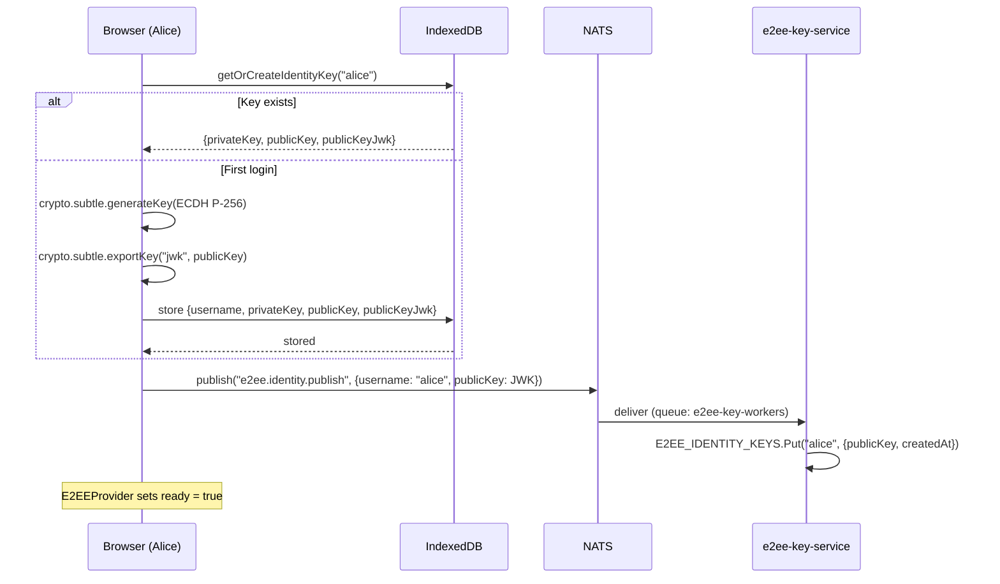
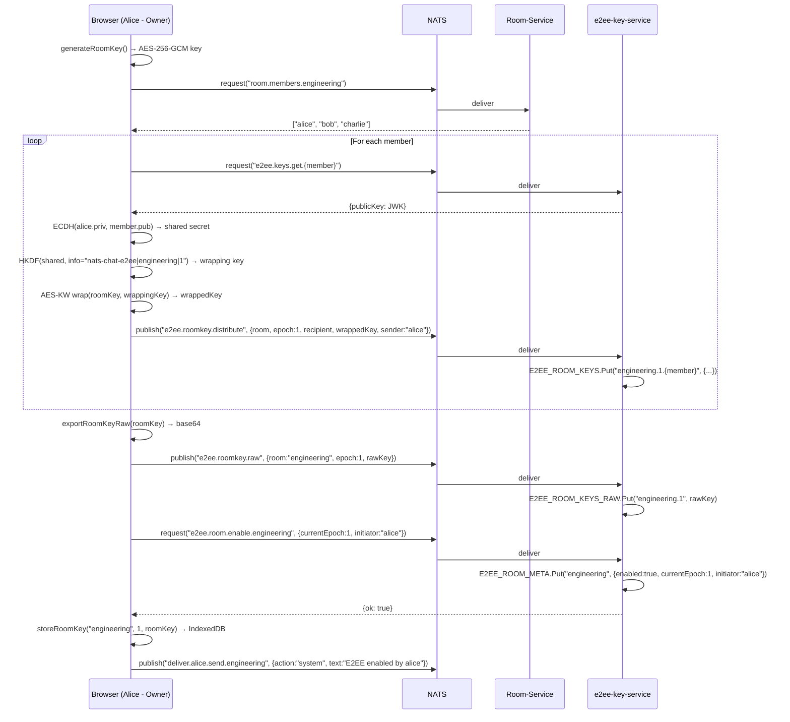
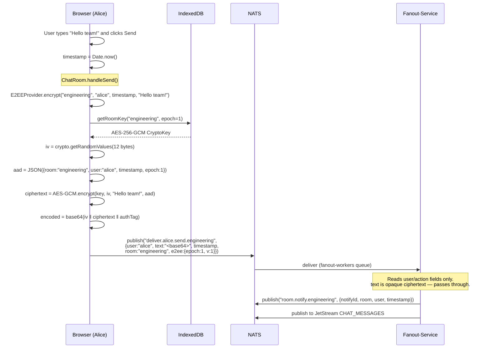
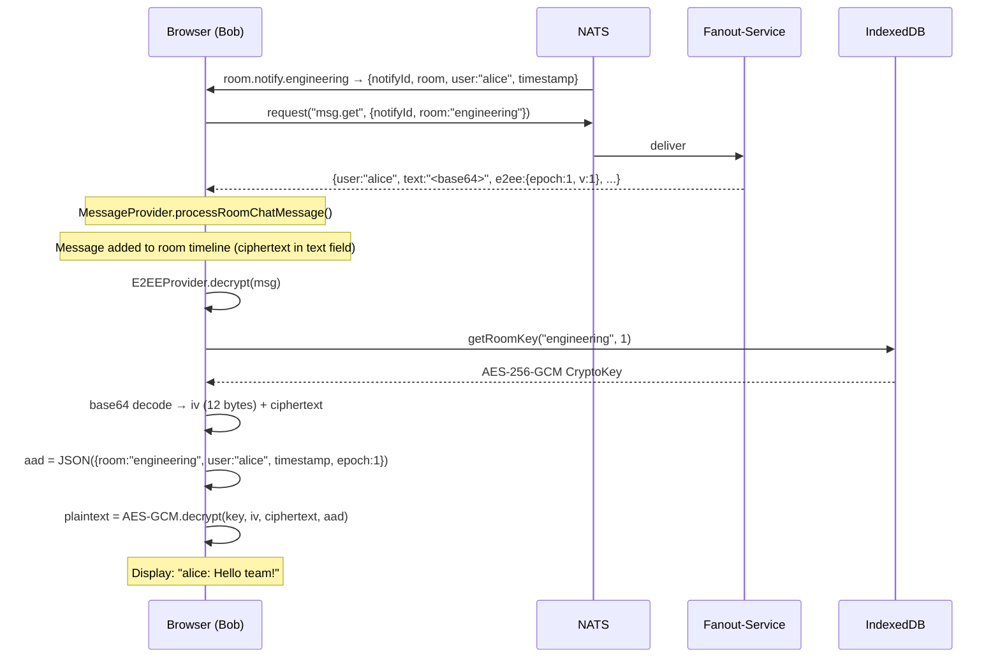
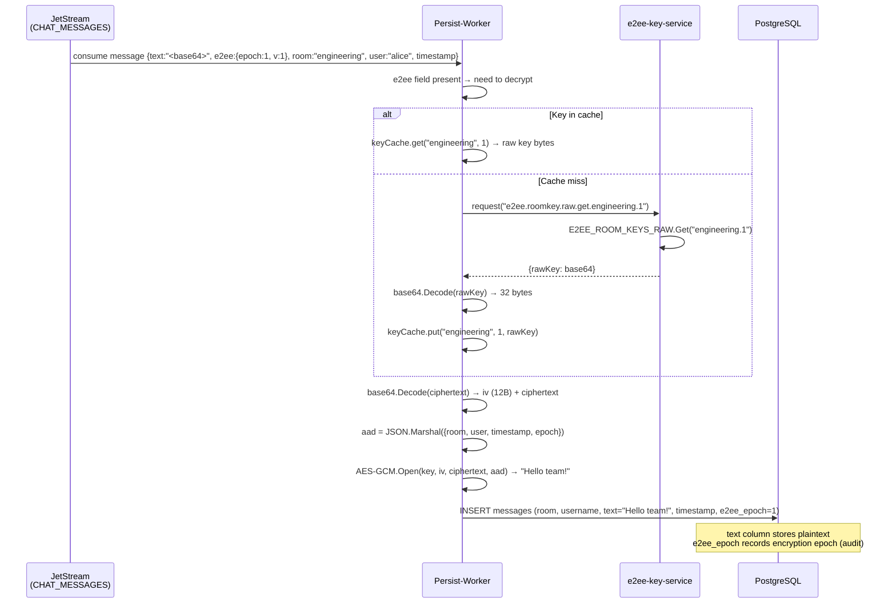
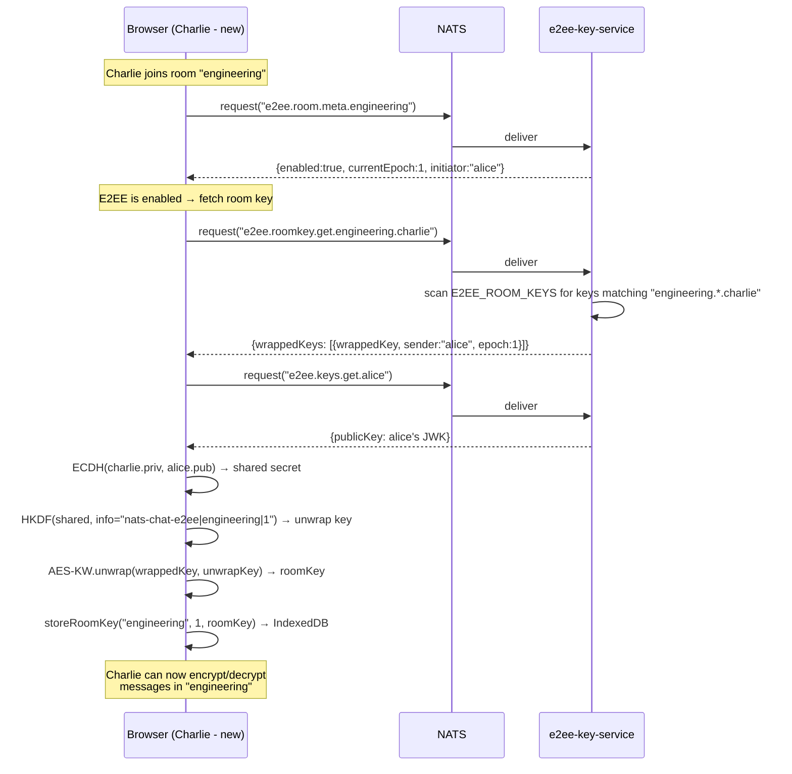
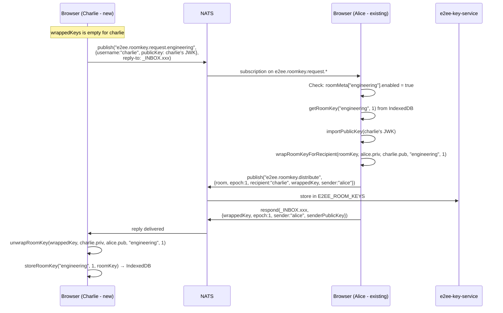
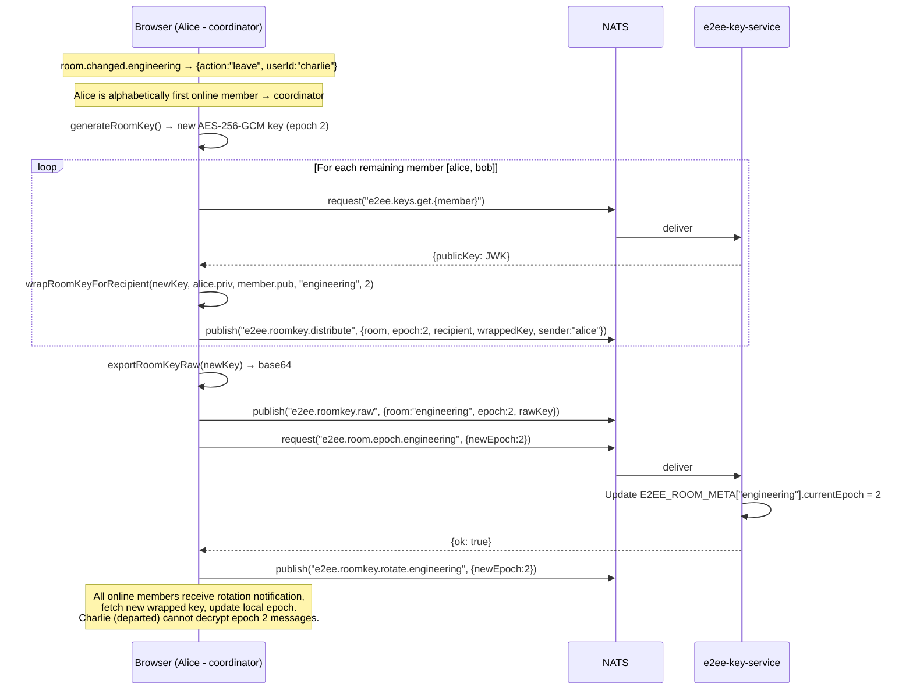
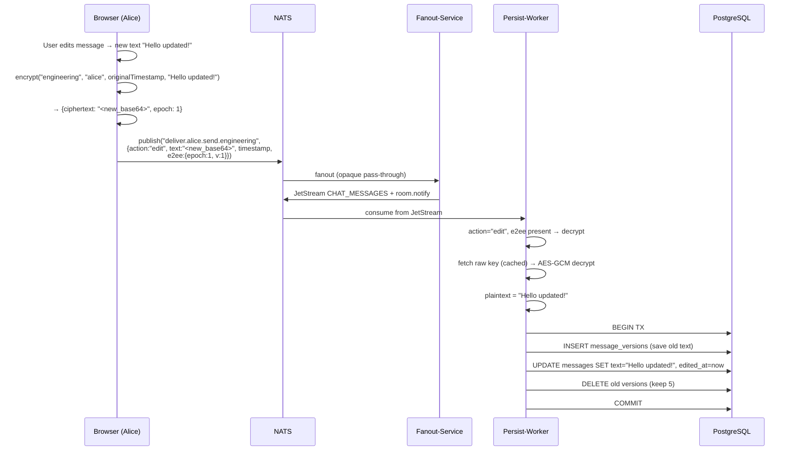
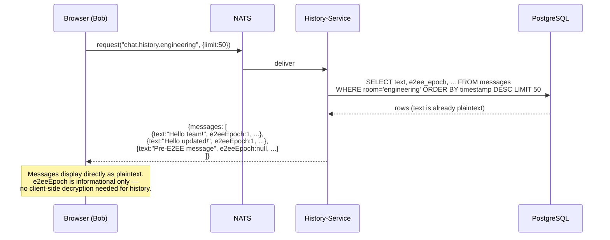

# E2EE Design — End-to-End Encryption for Private Rooms & DMs

## Overview

Opt-in end-to-end encryption for private rooms and DMs. Messages are encrypted in the browser (AES-256-GCM) before publishing to NATS, transit through fanout-service opaquely, and are decrypted server-side by persist-worker before storing plaintext in PostgreSQL. The `text` field is the only encrypted field — all routing metadata (room, user, timestamp, action, mentions, reactions) stays cleartext.

A new `e2ee-key-service` manages four NATS KV buckets for identity keys, wrapped room keys, raw room keys (for server-side decryption), and room metadata. All crypto operations happen in the browser via Web Crypto API; the server never performs key generation or wrapping.

## Design Decisions

| Decision | Choice | Rationale |
|----------|--------|-----------|
| Scope | Private rooms + DMs only | Public rooms don't need encryption; restricts complexity |
| Key exchange | ECDH P-256 + HKDF + AES-KW | Web Crypto native, no external dependencies |
| Message encryption | AES-256-GCM with AAD | Authenticated encryption, binds metadata to ciphertext |
| Forward secrecy | Per-room epoch keys (not per-message) | Double Ratchet incompatible with fan-out, multi-tab, out-of-order delivery |
| Mentions | Cleartext `mentions[]` array | Server-side unread mention counting requires it |
| DB storage | Plaintext (persist-worker decrypts) | Enables server-side search, history returns plaintext, simpler client |
| Raw key distribution | Browser publishes raw key to KV | Persist-worker needs it for server-side decryption |
| **Server-side key escrow** | **Raw AES keys stored in E2EE_ROOM_KEYS_RAW** | **Trade-off: enables server-side search/history but means the server _can_ read messages. This is NOT true E2EE — it's transport encryption + at-rest re-encryption. A compromised server or DB admin can access plaintext. Acceptable for this product's threat model (protect messages in transit and at rest from external attackers, not from server operators).** |
| Key rotation trigger | Membership change (leave/kick) | Forward secrecy at membership-event granularity |
| Translation | Disabled in UI for E2EE rooms | Server receives ciphertext, cannot translate |

## System Architecture

```
Browser (React + Web Crypto API)
  │
  │  ┌──────── E2EE Provider ────────┐
  │  │ Identity Key (ECDH P-256)     │    IndexedDB
  │  │ Room Keys (AES-256-GCM)       │◄──►(nats-chat-e2ee)
  │  │ encrypt() / decrypt()         │
  │  └──────────────┬────────────────┘
  │                 │
  │  handleSend() encrypts text ──► deliver.{user}.send.{room}
  │                                    │
  │                                    ▼
  │  ┌─────────── fanout-service ────────────────┐
  │  │ Opaque: reads user/action, ignores text   │
  │  │ Publishes to room.notify.{room} + JetStream│
  │  └──────────────────────────────┬────────────┘
  │                                 │
  │         ┌───────────────────────┼────────────────┐
  │         ▼                       ▼                ▼
  │  room.notify.{room}     CHAT_MESSAGES        e2ee-key-service
  │  (live delivery)        (JetStream)          (4 KV buckets)
  │         │                       │
  │         ▼                       ▼
  │  Browser fetches         persist-worker
  │  msg.get (encrypted)    ┌──────────────────┐
  │  decrypt() locally      │ fetch raw key    │
  │  display plaintext      │ AES-GCM decrypt  │
  │                         │ store plaintext  │
  │                         └───────┬──────────┘
  │                                 ▼
  │                           PostgreSQL
  │                         (text = plaintext)
  │                         (e2ee_epoch = N)
```

## Cryptographic Scheme

| Purpose | Algorithm | Key Size | Notes |
|---------|-----------|----------|-------|
| User identity key pair | ECDH P-256 | 256-bit | Non-extractable private key in IndexedDB |
| Per-room symmetric key | AES-256-GCM | 256-bit | Extractable (needed for wrapping + raw export) |
| Key derivation | HKDF-SHA-256 | — | Info: `nats-chat-e2ee\|{room}\|{epoch}` |
| Key wrapping | AES-KW | 256-bit | Wraps room key per-recipient |
| IV / Nonce | Random | 96-bit | Fresh per message via `crypto.getRandomValues()` |
| Auth tag | GCM | 128-bit | Included in ciphertext output |

### Key Hierarchy

```
User Identity Key (ECDH P-256, one per user)
  ├── Public half → E2EE_IDENTITY_KEYS KV bucket (JWK)
  ├── Private half → browser IndexedDB (non-extractable CryptoKey)
  │
  └── Per-Room Key (AES-256-GCM, 256 bits)
        ├── Identified by (room, epoch), epoch is monotonic integer
        ├── Wrapped per-recipient via: ECDH shared secret → HKDF → AES-KW
        ├── Raw copy → E2EE_ROOM_KEYS_RAW (for persist-worker)
        │
        └── Message Encryption:
              IV   = random 12 bytes
              AAD  = JSON.stringify({room, user, timestamp, epoch})
              text = base64(IV ‖ AES-GCM(key, IV, plaintext, AAD))
```

## NATS KV Buckets

| Bucket | Key Format | Value | Purpose |
|--------|------------|-------|---------|
| `E2EE_IDENTITY_KEYS` | `{username}` | `{"publicKey": JWK, "createdAt": N}` | User identity public keys |
| `E2EE_ROOM_KEYS` | `{room}.{epoch}.{username}` | `{"wrappedKey": base64, "sender": str, "epoch": N}` | Per-recipient wrapped room keys |
| `E2EE_ROOM_KEYS_RAW` | `{room}.{epoch}` | Base64 raw AES-256 key bytes | Server-side decryption by persist-worker |
| `E2EE_ROOM_META` | `{room}` | `{"enabled": bool, "currentEpoch": N, "initiator": str}` | Room E2EE state |

## NATS Subjects Reference

| Subject | Pattern | Type | Direction | Payload |
|---------|---------|------|-----------|---------|
| `e2ee.identity.publish` | Direct | Pub | Browser → KS | `{username, publicKey: JWK}` |
| `e2ee.keys.get.*` | `{username}` | Req/Rep | Browser → KS | → `{publicKey, createdAt}` |
| `e2ee.roomkey.distribute` | Direct | Pub | Browser → KS | `{room, epoch, recipient, wrappedKey, sender}` |
| `e2ee.roomkey.get.*.*` | `{room}.{username}` | Req/Rep | Browser → KS | → `{wrappedKeys: [...]}` |
| `e2ee.roomkey.raw` | Direct | Pub | Browser → KS | `{room, epoch, rawKey: base64}` |
| `e2ee.roomkey.raw.get.*.*` | `{room}.{epoch}` | Req/Rep | PW → KS | → `{rawKey: base64}` |
| `e2ee.room.enable.*` | `{room}` | Req/Rep | Browser → KS | `{room, currentEpoch, initiator}` → `{ok}` |
| `e2ee.room.disable.*` | `{room}` | Req/Rep | Browser → KS | → `{ok}` |
| `e2ee.room.meta.*` | `{room}` | Req/Rep | Browser → KS | → `{enabled, currentEpoch, initiator}` |
| `e2ee.room.epoch.*` | `{room}` | Req/Rep | Browser → KS | `{newEpoch}` → `{ok}` |
| `e2ee.roomkey.request.*` | `{room}` | Pub/Sub | Browser ↔ Browser | `{username, publicKey}` |
| `e2ee.roomkey.rotate.*` | `{room}` | Pub/Sub | Browser ↔ Browser | `{newEpoch}` |

**Legend:** KS = e2ee-key-service, PW = persist-worker

---

## Sequence Diagrams

### 7.1 Identity Key Initialization



---

### 7.2 Enable E2EE on Room



---

### 7.3 Sending an Encrypted Message



---

### 7.4 Receiving & Displaying an Encrypted Message



---

### 7.5 Server-Side Decryption (Persist-Worker)



---

### 7.6 New Member Joins E2EE Room



---

### 7.7 Key Request from Existing Member

When a new member's wrapped key doesn't exist in KV yet (e.g., joined after E2EE was enabled and no coordinator distributed the key):



---

### 7.8 Key Rotation on Member Leave



---

### 7.9 Editing an Encrypted Message



---

### 7.10 History Fetch for E2EE Room



---

## Encrypted Message Format

When E2EE is active, `ChatMessage` includes:

```typescript
interface ChatMessage {
  user: string;
  text: string;        // base64(IV ‖ ciphertext ‖ authTag) when e2ee present
  timestamp: number;
  room: string;
  e2ee?: {
    epoch: number;     // room key epoch used for encryption
    v: number;         // format version (always 1)
  };
  // All other fields (action, threadId, mentions, reactions, etc.) stay cleartext
}
```

**Wire format of `text` field:**

```
┌──────────┬──────────────────────────────────────┬──────────────┐
│ IV       │ AES-GCM Ciphertext                   │ Auth Tag     │
│ 12 bytes │ variable length                       │ 16 bytes     │
└──────────┴──────────────────────────────────────┴──────────────┘
                    ↓ base64 encoded ↓
              "SGVsbG8gdGVhbSE..." (stored in text field)
```

**AAD (Additional Authenticated Data):**
```json
{"room":"engineering","user":"alice","timestamp":1710288000000,"epoch":1}
```

## Browser Key Storage

**IndexedDB database:** `nats-chat-e2ee` (version 1)

| Object Store | Key Path | Contents |
|-------------|----------|----------|
| `identity_keys` | `username` | `{username, privateKey: CryptoKey, publicKey: CryptoKey, publicKeyJwk, createdAt}` |
| `room_keys` | `[room, epoch]` | `{room, epoch, key: CryptoKey, receivedAt}` |

- Private keys stored as non-extractable `CryptoKey` objects (structured clone, never in JS memory)
- Room keys stored as extractable `CryptoKey` (needed for re-wrapping during key distribution)
- Multi-tab sync via `BroadcastChannel("e2ee-key-updates")`

## Service Impact Summary

| Service | Path | Impact | Details |
|---------|------|--------|---------|
| **e2ee-key-service** | `e2ee-key-service/` | **New** | 4 KV buckets, 10 NATS subject handlers, queue group `e2ee-key-workers` |
| **persist-worker** | `persist-worker/` | **Moderate** | AES-256-GCM decrypt before DB insert, raw key cache, fetches from `e2ee.roomkey.raw.get.*.*` |
| **auth-service** | `auth-service/` | **Minor** | Added `e2ee.*` subjects to publish/subscribe allow lists for all role tiers |
| **history-service** | `history-service/` | **Minor** | Added `e2ee_epoch` to struct and SQL queries; returns plaintext |
| **fanout-service** | `fanout-service/` | **None** | Opaque to `text` content — encrypted payloads pass through unchanged |
| **room-service** | `room-service/` | **None** | `room.changed.*` events used by browser for key rotation coordination |
| **translation-service** | `translation-service/` | **None** | Disabled in UI for E2EE rooms (would receive ciphertext) |

## Auth Permissions per Role

| Subject | Admin | User | Read-Only |
|---------|:-----:|:----:|:---------:|
| `e2ee.identity.publish` | Pub | Pub | Pub |
| `e2ee.keys.get.*` | Pub | Pub | Pub |
| `e2ee.roomkey.distribute` | Pub | Pub | — |
| `e2ee.roomkey.raw` | Pub | Pub | — |
| `e2ee.roomkey.get.*.*` | Pub | Pub | Pub |
| `e2ee.roomkey.request.*` | Pub+Sub | Pub+Sub | — |
| `e2ee.roomkey.rotate.*` | Pub+Sub | Pub+Sub | — |
| `e2ee.room.enable.*` | Pub | Pub | — |
| `e2ee.room.disable.*` | Pub | Pub | — |
| `e2ee.room.meta.*` | Pub | Pub | Pub |
| `e2ee.room.epoch.*` | Pub | Pub | — |

## Feature Compatibility Matrix

| Feature | E2EE Room | Notes |
|---------|:---------:|-------|
| Send/receive messages | Full | Text encrypted on send, decrypted on receive |
| Edit messages | Full | Edited text re-encrypted, persist-worker decrypts |
| Delete messages | Full | Metadata-only operation, no text involved |
| Reactions | Full | Metadata-only, no encryption needed |
| Threading | Full | Thread messages encrypted same as regular |
| Stickers | Full | `stickerUrl` is cleartext metadata |
| Presence | Full | Separate system, unaffected |
| Read receipts | Full | Separate system, unaffected |
| @mention counts | Full | `mentions[]` array stays cleartext |
| History/scrollback | Full | DB stores plaintext (persist-worker decrypts) |
| Room apps (Poll, KB) | Full | Separate NATS subjects |
| DMs | Full | DMs use same encryption as private rooms |
| Translation | Disabled | Server receives ciphertext, cannot translate |
| Server-side search | Full | DB stores plaintext |

## Security Considerations

| Property | Status | Detail |
|----------|--------|--------|
| **Confidentiality in transit** | Yes | AES-256-GCM encryption over NATS WebSocket |
| **Confidentiality at rest** | No | Persist-worker decrypts before DB storage; DB stores plaintext. This is a deliberate trade-off: it enables server-side search, history, and admin moderation without client-side re-encryption. Deployments requiring at-rest confidentiality should disable server-side decryption and return ciphertext from history (clients decrypt locally). |
| **Integrity** | Yes | GCM auth tag + AAD binding prevents tampering |
| **Forward secrecy** | Partial | Per-epoch (membership change), not per-message |
| **Non-extractable identity keys** | Yes | Private key never leaves Web Crypto / IndexedDB |
| **Replay protection** | Partial | AAD binds (room, user, timestamp, epoch) to ciphertext, preventing cross-room/cross-user replay. Same-user same-timestamp replay is mitigated by JetStream deduplication and DB unique constraints. Full sequence-number-based replay protection is not implemented — acceptable given NATS transport guarantees. |
| **Metadata privacy** | No | Room, user, timestamp, mentions are cleartext |
| **Key compromise recovery** | Yes | Manual rotation via epoch bump; old epoch keys retained for history |
| **Multi-tab support** | Yes | BroadcastChannel syncs new room keys across tabs |

## Files Reference

| File | Role |
|------|------|
| `e2ee-key-service/main.go` | Key management service (KV buckets, NATS handlers) |
| `web/src/lib/E2EEManager.ts` | Crypto library (ECDH, AES-GCM, AES-KW, IndexedDB) |
| `web/src/providers/E2EEProvider.tsx` | React context (key lifecycle, encrypt/decrypt API) |
| `web/src/components/ChatRoom.tsx` | Encrypt on send/edit, E2EE UI toggle + lock icon |
| `web/src/components/MessageInput.tsx` | E2EE lock indicator in input area |
| `web/src/types.ts` | `E2EEInfo` interface on `ChatMessage` |
| `persist-worker/main.go` | Server-side AES-GCM decryption before DB insert |
| `history-service/main.go` | `e2ee_epoch` in SQL queries (informational) |
| `auth-service/permissions.go` | E2EE NATS subjects in role-based permission tiers |
| `postgres/init.sql` | `e2ee_epoch` column + `e2ee-key-service` service account |
| `docker-compose.yml` | `e2ee-key-service` container definition |
