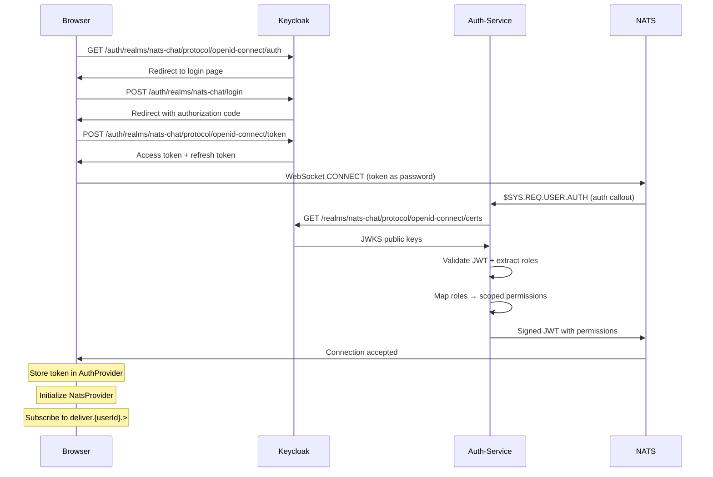
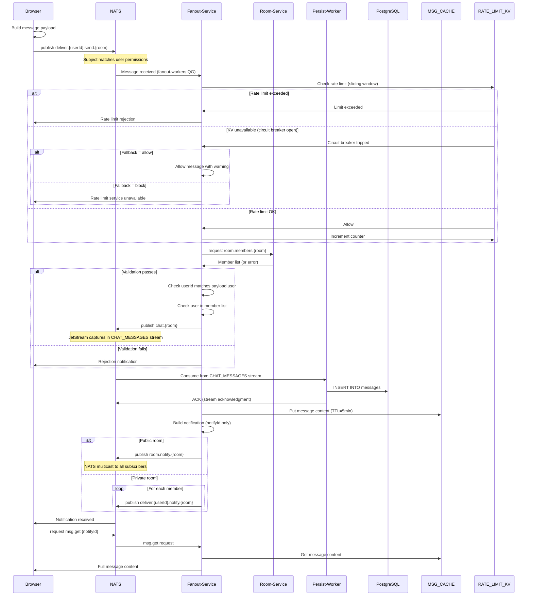
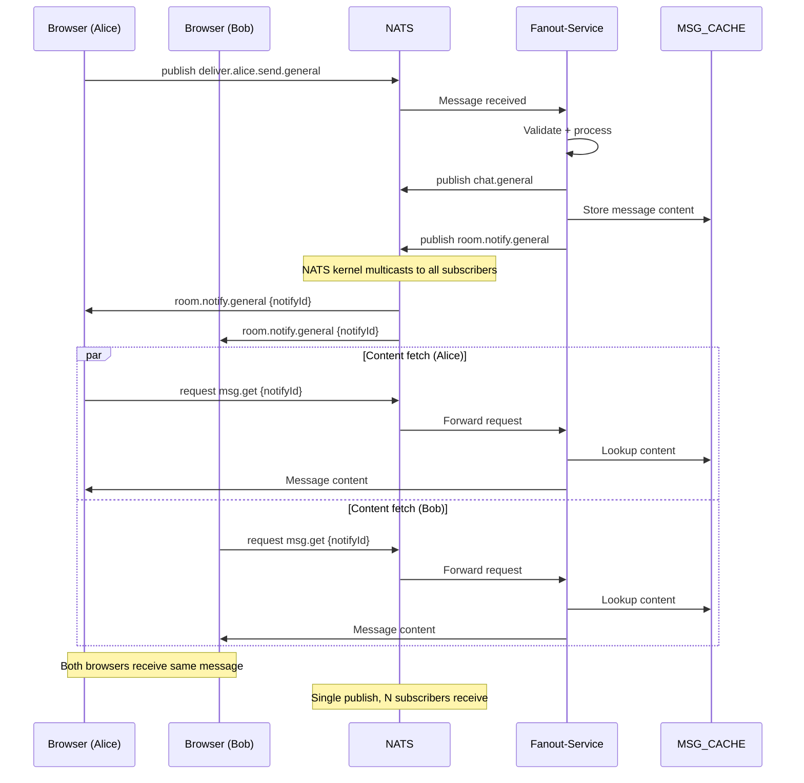
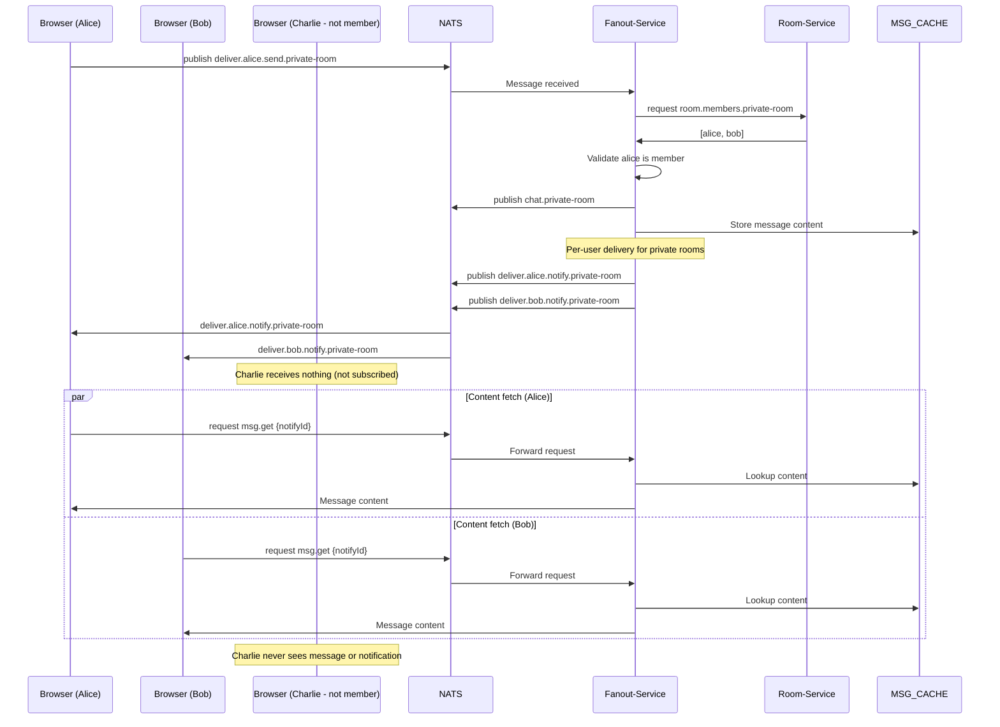
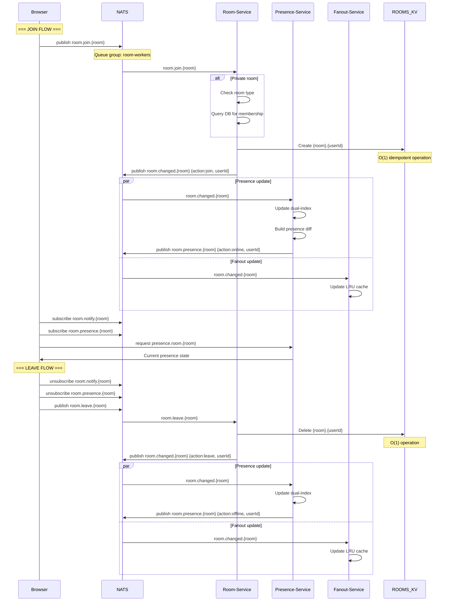
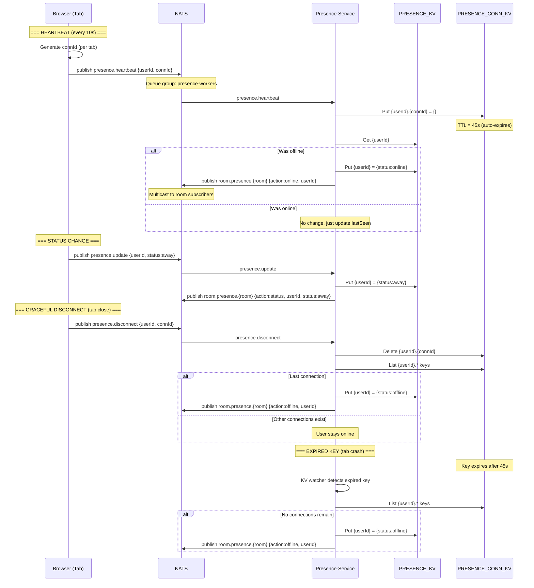
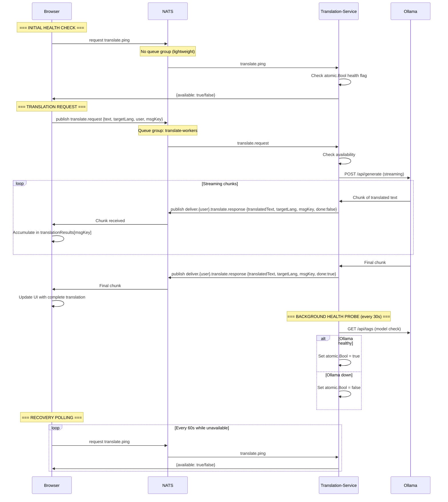
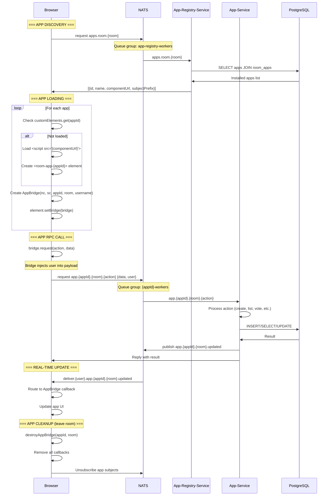
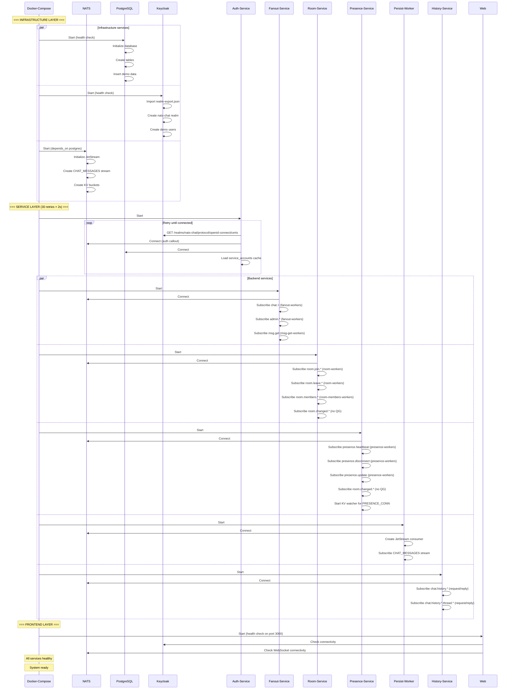

# NATS Chat Keycloak - Sequence Diagrams

## Table of Contents

1. [User Login Flow](#1-user-login-flow)
2. [Message Sending Flow](#2-message-sending-flow)
3. [Message Delivery Flow (Public Room)](#3-message-delivery-flow-public-room)
4. [Message Delivery Flow (Private Room)](#4-message-delivery-flow-private-room)
5. [Room Join/Leave Flow](#5-room-joinleave-flow)
6. [Presence Tracking Flow](#6-presence-tracking-flow)
7. [Translation Service Flow](#7-translation-service-flow)
8. [App Integration Flow](#8-app-integration-flow)
9. [Service Startup Flow](#9-service-startup-flow)

---

## 1. User Login Flow

---

## 2. Message Sending Flow

---

## 3. Message Delivery Flow (Public Room)

---

## 4. Message Delivery Flow (Private Room)

---

## 5. Room Join/Leave Flow

---

## 6. Presence Tracking Flow

---

## 7. Translation Service Flow

---

## 8. App Integration Flow

---

## 9. Service Startup Flow

---

## Key Flow Characteristics

### Security Boundaries
- **Authentication**: Keycloak OIDC → JWT → NATS auth callout → scoped permissions
- **Authorization**: Ingest validation + capability-based content access
- **Data Isolation**: Two-stream model prevents metadata leakage

### Performance Optimizations
- **Multicast vs Unicast**: Public rooms use NATS multicast (O(1) publish), private rooms use per-user delivery
- **Caching**: MSG_CACHE KV with 5-minute TTL for on-demand content fetch
- **Queue Groups**: Horizontal scaling for all services with message queuing
- **Delta Events**: Room membership changes propagate as compact delta events (~50 bytes)

### Failure Handling
- **Retry Logic**: 30 retries × 2s for service startup ordering
- **Graceful Degradation**: Translation service unavailability handled via health flag
- **Fail-Closed**: Ingest validation denies messages from non-members
- **Eventual Consistency**: Presence tracking uses CAS for offline transitions

### Scalability Patterns
- **Sharded KV**: Room membership uses per-key sharding for O(1) operations
- **Hybrid Delivery**: Public rooms scale to thousands of users, private rooms scale to room size
- **Singleflight**: Prevents thundering herd on concurrent cache misses
- **LRU Caching**: Configurable capacity for room membership cache

---

*These sequence diagrams illustrate the key flows in the NATS Chat Keycloak system, showing how the various components interact to provide a secure, scalable, real-time chat application.*
